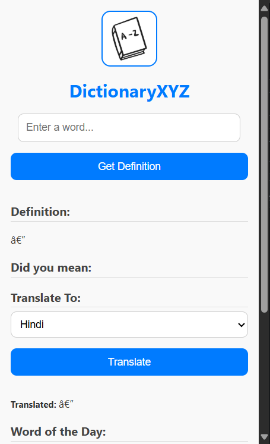

# 📚 DictionaryXYZ – Your Smart Dictionary Extension


> 🚀 A modern Chrome/Edge extension to look up dictionary definitions, translations, and explore a **Word of the Day** – backed by a Python Flask API and CSV dataset.

---

## 🔍 Features

* ✅ Instantly fetch word definitions.
* ✨ View "Word of the Day".
* 💡 Suggest closest matches for misspelled words.
* 🌐 Translate words into multiple languages.
* 🧠 Clean UI with easy interaction.
* ⚙️ Works locally with a lightweight Flask backend.

---

## 🎥 Demo in Action

**Example: Reading a book with difficult words**


**UI & Extension Walkthrough**


---

## 📸 Screenshots

| Popup UI                      | Definition & Translation                |
| ----------------------------- | --------------------------------------- |
|  |  |

> *(Screenshots should be added in a folder called `assets` for GitHub display.)*

---

## 📦 Project Structure

```
📁 DictionaryXYZ/
📅‍ backend/
│   ├── app.py               # Flask backend
│   └── dict.csv             # Word definitions
📅‍ extension/
│   ├── manifest.json        # Extension manifest
│   ├── popup.html           # Popup HTML UI
│   ├── popup.js             # Popup logic
│   ├── style.css            # Styling
│   └── logo.jpeg            # Icon
📁 assets/                  # Screenshots for README
README.md
```

---

## 🛠️ Setup Instructions

### 🔧 Backend (Flask API)

1. **Install dependencies**:

   ```bash
   pip install flask flask-cors pandas deep-translator
   ```

2. **Run the server**:

   ```bash
   python app.py
   ```

   > Make sure `dict.csv` is in the same directory as `app.py`.

### 🌐 Load Extension in Chrome/Edge

1. Open your browser and go to:

   ```
   chrome://extensions/
   ```
2. Enable **Developer mode** (top right).
3. Click **Load unpacked** and select the `extension/` folder.
4. Ensure the Flask server is running at `http://127.0.0.1:5000`.

---

## ⚙️ API Endpoints

| Method | Endpoint           | Description                       |
| ------ | ------------------ | --------------------------------- |
| POST   | `/define`          | Get definition and suggestions    |
| GET    | `/word-of-the-day` | Get a random word and its meaning |
| POST   | `/translate`       | Translate a word to selected lang |

---

## 💡 How It Works

1. User enters a word in the popup UI.
2. Extension sends a POST request to `/define`.
3. Backend checks the word in `dict.csv`.
4. Displays definition or closest matches.
5. Optionally, user can:

   * Translate the word using GoogleTranslator API.
   * Get the "Word of the Day".

---

## 🌍 Supported Languages (Translation)

* Hindi (hi)
* French (fr)
* Spanish (es)
* German (de)
* Tamil (ta)
* Japanese (ja)
* Arabic (ar)

---

## 📚 Use Cases

* 🧑‍🎓 **Students** looking for quick word definitions.
* ✍️ **Writers** needing word suggestions or inspiration.
* 🌐 **Language learners** translating key vocabulary.
* 🧠 **Curious minds** expanding their vocabulary daily.

---

## 🤔 Example API Usage

```javascript
fetch("http://127.0.0.1:5000/define", {
  method: "POST",
  headers: { "Content-Type": "application/json" },
  body: JSON.stringify({ word: "meticulous" })
})
.then(res => res.json())
.then(data => console.log(data));
```

---

## 🔒 Permissions Used

```json
"permissions": ["scripting"],
"host_permissions": ["http://127.0.0.1:5000/*"]
```

> Only local Flask server is accessed for fetching definitions.

---

## 📌 Future Improvements

* ✅ Online backend (e.g., Render/Heroku)
* 🔍 Auto-suggest while typing
* 🗃️ Add synonyms/antonyms
* 💾 Offline caching
* 🎤 Text-to-speech support

---

## 🧑‍💻 Built With

* [Flask](https://flask.palletsprojects.com/)
* [Pandas](https://pandas.pydata.org/)
* [deep-translator](https://pypi.org/project/deep-translator/)
* [Chrome Extension APIs](https://developer.chrome.com/docs/extensions/)
* HTML, CSS, JavaScript

---

## 🤝 Contributing

Pull requests are welcome! For major changes, please open an issue first to discuss what you'd like to change.

---

